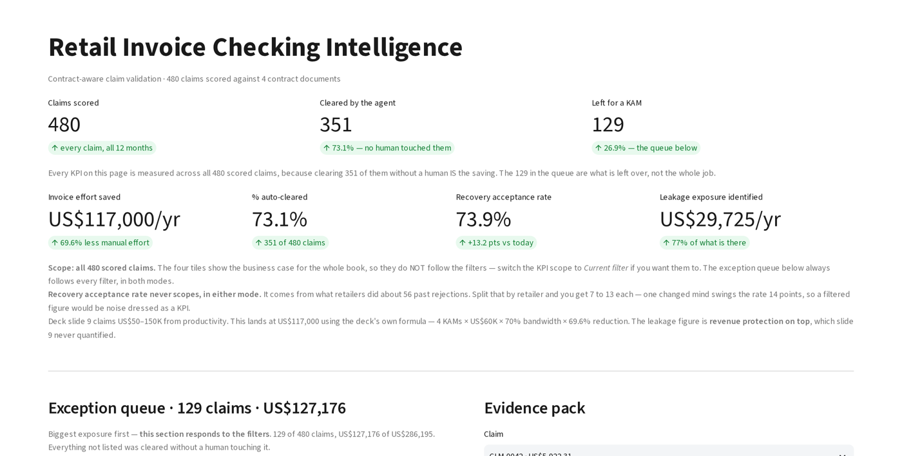

# Retail Invoice & Trade-Claim Validation Agent

An agent that reads retailer deduction claims, checks each one against the
governing supply contract, and returns a verdict with the clause it relied on.

Claims arrive from retailers as deductions against invoices - promotional
support, listing fees, damages, rebates. A commercial finance team cannot
check them all, so most are paid on trust and the exceptions are found late,
if at all. This agent scores every claim before payment and shows its
reasoning, so a human reviews the 27% that need judgement instead of all 100%.

Built on a synthetic dataset of 480 claims across 4 retailers, 12 months and
4 contract documents. Meridian is a fictional supplier and the four retailers
are invented. No client data is used anywhere in this repository.

**[▶ Open the live app](https://retail-invoice-agent.streamlit.app/)**

*Hosted free; if it shows a "wake app" button, give it about 30 seconds.*

---

## What it produces

| | Result on the demo dataset |
|---|---|
| Claims scored | 480 |
| Cleared automatically | 351 (73.1%) |
| Held for review | 67 |
| Rejected with a contract citation | 62 |
| Leakage identified | US$29,725 of US$38,763 present (76.7%) |
| Detection rate | 65% agent vs 53% current manual sample |
| Wrong rejections | 0 agent vs 10 manual |
| Clause citations produced | 263, none from a non-governing contract |

Every one of those figures is recomputed by `eval.py` from files the scoring
pipeline cannot read. Nothing is asserted by hand.

---

## How it works

**Run** - `main.py` scores each claim through five ordered gates.

    1  window        was the claim raised inside the contractual window
    2  eligibility   is this claim type payable under this retailer's contract
    3  clause        does the governing contract permit the rate claimed
    4  arithmetic    does the amount recompute from the price list and volume
    5  duplicate     has this promotion reference already been settled

A claim that clears all five is AUTO_CLEAR. A claim that fails a hard gate is
REJECT with the clause quoted. Anything the agent cannot decide is HOLD - it
is never guessed.

**Retrieval** - `retrieval.py` splits the four contract documents into 110
clause-level chunks, filters to the contract that actually governs the
retailer, and only then ranks by TF-IDF cosine similarity. Filtering before
searching is the reason no citation ever comes from the wrong contract. With
the filter removed, 19 verdicts flip and US$6,583 of exposure is misread -
that counterfactual is measured, not claimed.

**Store** - `store.py` writes one row per claim with the verdict, the gate
that fired, the clause id, and the retrieved text. A verdict with no citable
clause is an unusable verdict; it is held, not sent.

**Ship** - `app.py` is a Streamlit review queue. It computes nothing at
display time - it reads the CSVs the pipeline already wrote, so what a
reviewer sees is exactly what was scored.

---

## Run it

    pip install -r requirements.txt
    python -m streamlit run app.py

`data/`, `contracts/` and `store/` are committed, so the app runs straight
from a clone. The app computes nothing at demo time - it reads pre-written
CSVs.

## Rebuild the outputs from scratch

    python generate_data.py       # synthetic claims, contracts, price list
    python main.py                # score all 480 claims
    python store.py               # write the decision and citation tables
    python eval.py                # recompute the scorecard

`eval.py` is the only file permitted to open the answer key. Nothing that
produces a verdict can see it, which is what makes the scorecard a
measurement rather than a restatement.

---

## Layout

    main.py          the five gates, in order
    rules.py         each gate as an independent, testable function
    tests/           invariant tests - see below
    retrieval.py     clause chunking, contract filter, TF-IDF ranking
    llm_extract.py   field extraction from unstructured claim text
    store.py         decision and citation tables
    eval.py          scorecard - the only reader of the answer key
    app.py           Streamlit review queue
    data/            claims, price list, retailer master, answer key
    contracts/       four contract documents in markdown
    store/           scored outputs, committed so the app runs on clone

---

## The tests

    python -m pytest -q          # 10 tests, ~3s

They assert properties, not numbers. A test that pins 351 auto-clears breaks
whenever a threshold moves and proves nothing about whether the agent is
sound. These assert what the agent promises:

| Test | What breaks it |
|---|---|
| No rejection without a clause | A gate returns REJECT with an empty citation |
| No citation from a non-governing contract | Retrieval ranks before the contract filter, instead of after |
| Nothing unsubstantiated is auto-cleared | A gate falls through to the AUTO_CLEAR at the end of `evaluate()` |
| The window gate outranks every later gate | Gate order is changed so a late claim can be rescued by good arithmetic |
| Scoring twice gives the same answer | A tie-break starts depending on dict or set ordering |

Each was checked by breaking it: swapping one citation to the wrong contract,
stripping a citation off a rejection, and flipping a substantiation hold to a
clear are all caught. A test that cannot fail is not evidence.

## Honest notes

The dataset is synthetic and generated by `generate_data.py` with a fixed
seed, so every number above reproduces exactly. The leakage rates and error
patterns are ones I designed in; on real data the levels will differ. What
transfers is the method - ordered gates, a contract filter ahead of
retrieval, a quarantined answer key, and a hold verdict for anything the
agent cannot substantiate.
